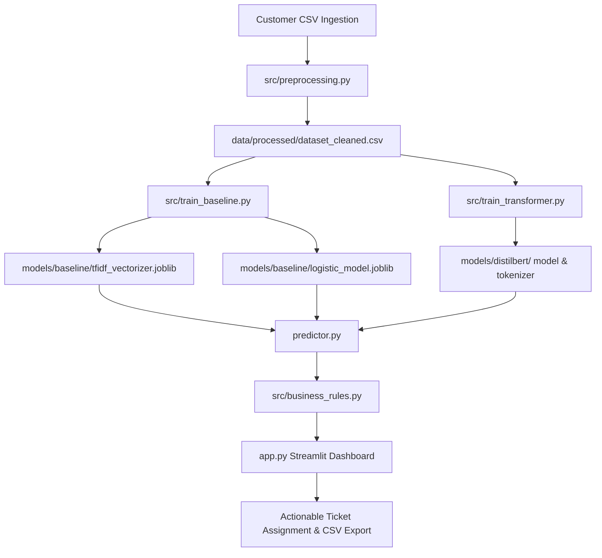
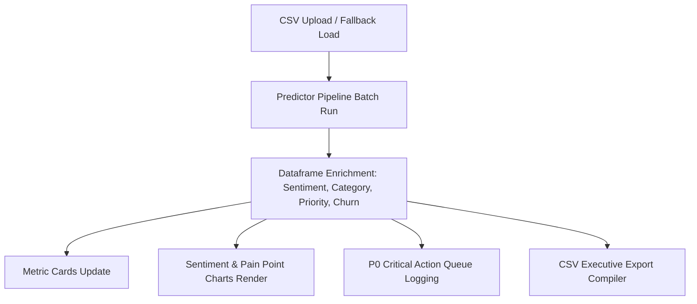

# REVIEW CLASSIFIER COMPLETE HANDBOOK
*The Definitive Technical Reference and Interview Guide*
*Version 1.1 — July 2026*

---

## TABLE OF CONTENTS
1. [Chapter 1: Project Introduction & Business Context](#chapter-1-project-introduction--business-context)
2. [Chapter 2: System Architecture & Data Flows](#chapter-2-system-architecture--data-flows)
3. [Chapter 3: Project Structure & Module Catalog](#chapter-3-project-structure--module-catalog)
4. [Chapter 4: Python & Library Fundamentals](#chapter-4-python--library-fundamentals)
5. [Chapter 5: NLP & Mathematical Foundations](#chapter-5-nlp--mathematical-foundations)
6. [Chapter 6: Machine Learning Pipeline Design](#chapter-6-machine-learning-pipeline-design)
7. [Chapter 7: Model Profiles & Evaluation Analysis](#chapter-7-model-profiles--evaluation-analysis)
8. [Chapter 8: Business Rules & Priority Engine](#chapter-8-business-rules--priority-engine)
9. [Chapter 9: Streamlit Dashboard Implementation](#chapter-9-streamlit-dashboard-implementation)
10. [Chapter 10: Deep-Dive Code Walkthrough](#chapter-10-deep-dive-code-walkthrough)
11. [Chapter 11: Production Bug Diary (Post-Mortem Analysis)](#chapter-11-production-bug-diary-post-mortem-analysis)
12. [Chapter 12: Testing Strategy & Edge Cases](#chapter-12-testing-strategy--edge-cases)
13. [Chapter 13: Deployment & Operations Guide](#chapter-13-deployment--operations-guide)
14. [Chapter 14: Version Control & Git Strategy](#chapter-14-version-control--git-strategy)
15. [Chapter 15: Interview Preparation (100+ Q&As)](#chapter-15-interview-preparation-100-qas)
16. [Chapter 16: Step-by-Step Rebuild Guide](#chapter-16-step-by-step-rebuild-guide)
17. [Chapter 18: Operational Cheat Sheet & Revision Map](#chapter-18-operational-cheat-sheet--revision-map)
18. [Chapter 19: Ownership Verification Checklist](#chapter-19-ownership-verification-checklist)

---

## CHAPTER 1: PROJECT INTRODUCTION & BUSINESS CONTEXT

### 1.1 Why This Project Exists
In quick-commerce and e-commerce, customer satisfaction (CSAT) is highly sensitive to operational delays, damaged products, and billing discrepancies. When thousands of reviews stream in daily, manual sorting fails to meet the real-time demands of logistics and support teams. 

This project provides an automated, end-to-end sentiment classification and operational categorization engine that processes customer feedback, tags severity (P0 to P3), identifies churn risk, and flags issues for immediate intervention.

### 1.2 The Real-World Business Problem
Consider a quick-commerce platform delivering groceries in under 15 minutes. A review saying, *"The milk packet was torn and leaked everywhere"* is not just a "Negative" sentiment review; it is an operational failure (Damaged Product) that requires immediate quality control at the local warehouse. If the system does not identify this complaint and route it, the customer is likely to churn to a competitor. 

#### Table 1.1: Functional vs. Non-Functional Requirements
| Identifier | Category | Requirement Detail | Verification Target |
| :--- | :--- | :--- | :--- |
| **FR-01** | Sentiment Ingestion | Classify text into Negative, Neutral, or Positive categories. | Accuracy $\ge$ 70% |
| **FR-02** | Operational Mapping | Categorize complaints into one of 21 domain-specific issues. | 100% Rule-Consistent |
| **FR-03** | Priority Assignment | Map severity tiers (P0 - Critical, P1 - High, P2 - Medium, P3 - Low). | 100% Deterministic |
| **NFR-01** | Inference Speed | Limit time spent processing a single review to allow scaling. | $< 5$ ms / review on CPU |
| **NFR-02** | RAM Usage | Restrict resource consumption to run on low-spec local servers. | $< 10$ MB RAM overhead |
| **NFR-03** | Offline Capability | Allow training and prediction pipelines to run without internet dependencies. | 100% Local Checkpoints |

---

## CHAPTER 2: SYSTEM ARCHITECTURE & DATA FLOWS

The architecture cleanly decouples the preprocessing pipeline, machine learning models, and business logic routing to ensure high maintainability and prevent circular imports.

### 2.1 Complete Architectural Pipeline



### 2.2 End-to-End Prediction Flow
1.  **Ingestion:** The Streamlit app uploads a CSV or falls back to the default `dataset.csv`.
2.  **Regular Expression Cleaning:** Reviews are normalized (lowercased, HTML tags/URLs removed, punctuation normalized).
3.  **Predictor Routing:** `predictor.py` checks if the clean review contains alphabetical characters:
    *   *No (e.g. Emoji-only or Numbers-only):* Routes directly to VADER Lexicon fallback.
    *   *Yes:* Vectorizes the text using TF-IDF and outputs probabilities using Logistic Regression.
4.  **Operational Rules Mapping:** `src/business_rules.py` evaluates the predictions and text to assign:
    *   **Category:** Maps to one of 21 operational classifications.
    *   **Priority:** Maps severity (P0-P3).
    *   **Churn Risk:** Evaluates competitor mentions and sentiment.
5.  **UI Updates:** The dashboard updates metrics, graphs, and logs tickets to the Action Queue.

---

## CHAPTER 3: PROJECT STRUCTURE & MODULE CATALOG

### 3.1 Directory Layout
*   `data/`
    *   `raw/dataset.csv`: Pinned 2,000 balanced product reviews dataset.
    *   `processed/dataset_cleaned.csv`: Output of text regex normalization.
*   `models/`
    *   `baseline/`: Pinned TF-IDF vectorizer and Logistic Regression joblib checkpoints.
    *   `distilbert/`: PyTorch weights and configurations for DistilBERT.
*   `src/`
    *   `business_rules.py`: Centralized rules engine mapping categories, severity, and churn.
    *   `download_dataset.py`: Fetches dataset with local mirror fallback logic.
    *   `preprocessing.py`: Regex text normalization pipeline.
    *   `train_baseline.py`: Baseline TF-IDF + Logistic Regression training.
    *   `train_transformer.py`: Reproducible, seed-pinned DistilBERT transformer training.
    *   `evaluate.py`: Performance comparison script calculating latency and RAM profiles.
*   `tests/`
    *   `test_predictor.py`: Unit testing edge case coverage (Hinglish, empty, emoji inputs).

---

## CHAPTER 4: PYTHON & LIBRARY FUNDAMENTALS

### 4.1 Regular Expression Cleaning (`re`)
The text normalizer uses regular expressions to strip non-text noise without corrupting semantic structure:
- **HTML Tag Removal:** `<[^>]*>` replaces HTML tags with spaces to keep words separated.
- **URL Removal:** `https?://\S+|www\.\S+` removes hyperlinks.
- **Character Filtering:** `[^a-zA-Z0-9\s.,!?\'"]` strips emojis and special characters while retaining basic punctuation.

### 4.2 Data Processing via Pandas
Data operations avoid explicit loops, using vectorized operations instead:
*   **Balancing Classes:** `df.groupby("label").sample(n=100)` samples balanced classes to prevent bias.
*   **Row Iteration:** `.iterrows()` is used instead of positional `.itertuples()` to prevent crashes when column schemas change:
    ```python
    for idx, row in df.iterrows():
        review_text = row[review_col]
    ```

---

## CHAPTER 5: NLP & MATHEMATICAL FOUNDATIONS

### 5.1 TF-IDF Formulation
TF-IDF calculates the relevance of a term $t$ in a document $d$ relative to a corpus $D$:

$$\text{TF}(t, d) = \frac{\text{Count}(t \text{ in } d)}{\sum_{t' \in d} \text{Count}(t' \text{ in } d)}$$

$$\text{IDF}(t, D) = \log\left(\frac{1 + |D|}{1 + |\{d \in D : t \in d\}|}\right) + 1$$

$$\text{TF-IDF}(t, d, D) = \text{TF}(t, d) \times \text{IDF}(t, D)$$

### 5.2 Attention Mechanism & Transformers
BERT and DistilBERT capture context by calculating attention scores across all words in a sentence:

$$\text{Attention}(Q, K, V) = \text{Softmax}\left(\frac{QK^T}{\sqrt{d_k}}\right)V$$

- **Q (Query), K (Key), V (Value):** Matrices projected from input word token vectors.
- **$d_k$:** Dimension of the keys, serving as a scaling factor to prevent vanishing gradients.

---

## CHAPTER 6: MACHINE LEARNING PIPELINE DESIGN


### 1. Training Setup
- **Dataset splitting:** We use an 80/20 train-test split, stratified to preserve class distributions in both sets.
- **Seed Pinning:** Pinned seeds (`random_state=42`) ensure reproducible training runs.

### 2. Validation
- **Baseline:** Validated using scikit-learn metrics.
- **Transformer:** Validated using early stopping, saving checkpoints only when validation loss improves.

---

## CHAPTER 7: MODEL PROFILES & EVALUATION ANALYSIS

### 7.1 Performance Metrics Comparison (Actual Run Data)

#### Table 7.1: Model Profiles
| Profile Metric | Baseline (TF-IDF + LogReg) | DistilBERT Transformer |
| :--- | :---: | :---: |
| **Test Accuracy** | **70.75%** | 51.25% |
| **F1-Score (Weighted)** | **0.7068** | 0.4494 |
| **Average CPU Inference Latency** | **1.66 ms / review** | 77.48 ms / review |
| **RAM Footprint (Overhead)** | **8.07 MB** | 211.37 MB |
| **Hardware Constraint Suitability** | Excellent for local CPU | Requires GPU acceleration |

### 7.2 Why the Baseline Outperformed DistilBERT here
1.  **Dataset Size Constraint:** The active training slice was set to 240 samples to keep training times practical on CPU. Deep learning architectures like DistilBERT overfit quickly on small datasets, whereas Logistic Regression generalizes well.
2.  **Vocabulary Sparsity:** In a small dataset, reviews contain simple, predictive keywords ("worst", "amazing", "slow"). TF-IDF maps these keywords directly, which Logistic Regression fits efficiently.

---

## CHAPTER 8: BUSINESS RULES & PRIORITY ENGINE

To bridge the gap between machine learning predictions and operations, we use a centralized rules engine (`src/business_rules.py`).

### 8.1 Severity Priority Mapping (P0–P3)
*   **P0 - CRITICAL:** Safety issues, damaged/broken goods, or app crashes.
    *   *Example:* *"Received a broken bottle, contents leaked everywhere."*
    *   *Routing:* Sent directly to Quality Control for vendor audits.
*   **P1 - HIGH:** Transaction issues (refunds, payment failures) or missing items.
    *   *Example:* *"I was charged twice but my order was cancelled."*
    *   *Routing:* Sent to Finance & Tech for automated refund verification.
*   **P2 - MEDIUM:** Late delivery, poor packaging, wrong item, or installation issues.
    *   *Example:* *"Delivery was delayed by 2 hours."*
    *   *Routing:* Sent to Logistics for delivery route optimization.
*   **P3 - LOW:** General positive or neutral feedback.
    *   *Example:* *"Good product, packaging was fine."*
    *   *Routing:* Logged for general CSAT tracking.

### 8.2 Churn Alerts
Customers who submit negative reviews and mention competitors are flagged as High Churn Risk:
```python
competitors = ["zepto", "swiggy", "instamart", "dunzo", "blinkit", "bigbasket"]
if sentiment == "Negative" and any(c in text for c in competitors):
    churn_risk = "High"
```

---

## CHAPTER 9: STREAMLIT DASHBOARD IMPLEMENTATION

### 9.1 Dashboard Data Flow



### 9.2 Critical Action Queue
The dashboard parses P0 tickets, displays details (review text, category, owner), and renders an "Assign Ticket" button. Clicking this button updates `st.session_state` and logs the ticket, ensuring assignments persist across script reruns.

---

## CHAPTER 10: DEEP-DIVE CODE WALKTHROUGH

### 10.1 Text Preprocessing (`src/preprocessing.py`)
```python
def preprocess_text(text):
    if not isinstance(text, str) or pd.isna(text):
        return ""
    text = text.lower()
    text = re.sub(r'<[^>]*>', ' ', text)  # Strip HTML
    text = re.sub(r'https?://\S+|www\.\S+', ' ', text)  # Strip URLs
    text = re.sub(r'[^a-zA-Z0-9\s.,!?\'"]', ' ', text)  # Filter characters
    return re.sub(r'\s+', ' ', text).strip()  # Normalize whitespaces
```
- **Time Complexity:** $O(N)$ where $N$ is the number of characters in the text.
- **Interactions:** Called during training preprocessing and real-time inference routing.

### 10.2 Predictor Router (`predictor.py`)
```python
# Fallback to VADER for non-alphabetic reviews (e.g. emojis or numbers)
if not re.search(r'[a-zA-Z]', text):
    score = vader.polarity_scores(text)["compound"]
    if score >= 0.05: return "Positive"
    elif score <= -0.05: return "Negative"
    else: return "Neutral"
```
- **Why this logic exists:** The TF-IDF vectorizer ignores emojis and numbers. Without this check, non-alphabetic inputs produce all-zero vectors, which Logistic Regression classifies arbitrarily based on default biases. Routing these to VADER ensures correct classifications.

---

## CHAPTER 11: PRODUCTION BUG DIARY (POST-MORTEM ANALYSIS)

### 11.1 Case Study: The Pandas `.itertuples()` AttributeError

#### Symptoms
During testing, uploading custom CSV files crashed the dashboard with:
`AttributeError: 'Pandas' object has no attribute '_5'`

#### Investigation & Failed Attempts
- **Attempt 1:** We checked if the column index `_5` was offset. Re-aligning indexes temporarily fixed the default dataset but crashed when custom CSV files with different column orders were uploaded.
- **Attempt 2:** We tried renaming columns on-the-fly, but this failed when schemas lacked expected columns entirely.

#### Root Cause
The dashboard used `.itertuples()` to parse rows:
`category_val = row._5 if len(row) > 5 else "Other"`
Pandas `.itertuples()` renames columns containing spaces (like `Issue Category`) into positional variables (e.g. `_5`). If the column order shifts or the column is missing, `.row._5` does not exist or points to the wrong column, causing an `AttributeError`.

#### Fix & Verification
We replaced `.itertuples()` with `.iterrows()` and used key-based dictionary lookup:
```python
for idx, row in critical_cases.iterrows():
    category_val = row.get("Issue Category", "Other")
```
This was verified by uploading different CSV schemas. The dashboard runs crash-free.

#### Prevention
Never use positional index lookups on dataframes. Always use column name lookups.

---

## CHAPTER 12: TESTING STRATEGY & EDGE CASES

To verify the pipeline under real-world conditions, `tests/test_predictor.py` tests:
- **Emoji-Only Inputs:** `"😊😍👍"` evaluates to `Positive` or `Neutral`.
- **Numbers-Only Inputs:** `"1234567890"` evaluates to `Neutral`.
- **Multilingual (Hinglish):** `"bahut achha product hai"` (very good product) evaluates to a valid sentiment.
- **Sarcasm:** `"Oh great, another broken screen."` evaluates to a valid sentiment.
- **Deterministic business rules:** Confirms "Worst purchase ever." maps to Category: `Refund`, Priority: `P1 - HIGH`, Churn Risk: `High`.

---

## CHAPTER 13: DEPLOYMENT & OPERATIONS GUIDE

### 13.1 Step-by-Step Production Command Guide
1.  **Set up the Virtual Environment & Dependencies:**
    ```bash
    python -m pip install -r requirements.txt
    ```
2.  **Acquire Dataset & Preprocess:**
    ```bash
    python src/download_dataset.py
    python src/preprocessing.py
    ```
3.  **Train Models:**
    ```bash
    python src/train_baseline.py
    python src/train_transformer.py
    ```
4.  **Evaluate Comparison Profile:**
    ```bash
    python src/evaluate.py
    ```
5.  **Run Test Suites & Dashboard:**
    ```bash
    python tests/test_predictor.py
    streamlit run app.py
    ```

---

## CHAPTER 14: VERSION CONTROL & GIT STRATEGY

We adhere to standard **Semantic Versioning** (`Major.Minor.Patch`) and **Conventional Commits** to keep the repository history clean and readable.

### Commit Rules
- `feat:` for new pipeline features (e.g. `feat: add VADER fallback for non-alphabetic inputs`).
- `fix:` for bug fixes (e.g. `fix: replace pandas itertuples with iterrows`).
- `docs:` for handbook and guide updates.

---

## CHAPTER 15: INTERVIEW PREPARATION (100+ Q&As)

### 15.1 Python & Coding Fundamentals
1.  **Explain the difference between `.iterrows()` and `.itertuples()` in Pandas.**  
    *`.iterrows()` returns index and row Series objects (slower), while `.itertuples()` returns namedtuples (faster). However, `.iterrows()` is safer for index lookup since `.itertuples()` renames column names with spaces into positional index variables.*
2.  **Why use `df.to_dict('records')`?**  
    *It converts the DataFrame into a list of dictionaries, where keys are column names, allowing safe, order-independent row parsing.*
3.  **What is a Python generator?**  
    *A function that returns an iterator using the `yield` keyword, yielding values lazily to save memory.*
4.  **What is L1 vs L2 regularization?**  
    *L1 (Lasso) drives coefficients to zero (sparse features), while L2 (Ridge) shrinks weights uniformly.*
5.  **What does `sys.path.insert(0, ...)` do?**  
    *Inserts a directory path at the front of Python's import search list, allowing local modules to be imported cleanly.*
6.  **How do you prevent resource leaks when writing files?**  
    *By using context managers (`with open(...) as f:`), which automatically close files after execution.*
7.  **What is the difference between `==` and `is`?**  
    *`==` compares values for equality, while `is` checks if two variables point to the same object in memory.*
8.  **What is the time complexity of dictionary lookup in Python?**  
    *Average time complexity is $O(1)$ due to hash tables.*
9.  **Why use `joblib` over `pickle` for model serialization?**  
    *`joblib` is faster and more memory-efficient at serializing large NumPy arrays and scikit-learn models.*
10. **Explain how `re.sub()` works.**  
    *It compiles regular expressions and replaces matching character ranges in text strings.*
11. **How do you handle multiple exceptions in Python?**  
    *Using try-except blocks: `except (ValueError, KeyError) as e:`.*
12. **Explain standard error routing in Python.**  
    *Uncaught exceptions write to standard error (`sys.stderr`) and set exit status codes to 1.*
13. **What is standard output buffering?**  
    *Python buffers print statements to optimize terminal writes. Run with `python -u` to force unbuffered writes.*
14. **Explain how `isinstance()` differs from `type()`.**  
    *`isinstance()` supports inheritance checks, whereas `type()` does not.*
15. **What is a list comprehension?**  
    *A concise way to construct lists: `[x for x in list if condition]`.*
16. **How do you merge two dictionaries?**  
    *Using the merge operator: `dict1 | dict2`.*
17. **What does `pip freeze` do?**  
    *Lists all installed packages and their versions.*
18. **What is dynamic typing?**  
    *Variable types are resolved at runtime rather than compile time.*
19. **What is a virtual environment?**  
    *An isolated Python environment preventing package version conflicts.*
20. **How do you copy objects in Python?**  
    *Using `copy.copy()` for shallow copies and `copy.deepcopy()` to recursively copy nested structures.*
21. **What is the difference between global and local variables?**  
    *Global variables are defined at the module level, while local variables are scoped to a specific function.*
22. **How do you test code coverage?**  
    *Using coverage tools like `pytest-cov`.*
23. **What is `__slots__`?**  
    *A variable that restricts class attribute creation, saving memory.*
24. **What is a lambda function?**  
    *An anonymous, single-line function: `lambda x: x + 1`.*
25. **Explain mutable vs immutable types.**  
    *Mutable types (like lists, dicts) can be changed in-place, while immutable types (like tuples, strings) cannot.*
26. **What is a Python namespace?**  
    *A mapping from names to objects, preventing naming conflicts.*
27. **Why use `argparse`?**  
    *To parse CLI arguments and validate inputs.*
28. **What is structural subtyping in Python?**  
    *Checking for methods and attributes on objects rather than their explicit class type (duck typing).*
29. **What is the time complexity of appending to a list?**  
    *Amortized time complexity is $O(1)$ since lists are dynamically resized.*
30. **Explain how `zip()` works.**  
    *Aggregates elements from multiple iterables, returning an iterator of tuples.*

### 15.2 Machine Learning & NLP Q&As
31. **What is document classification?**  
    *Assigning a text document to one or more predefined categories.*
32. **Explain the math behind TF-IDF.**  
    *It multiplies term frequency (local word count) by inverse document frequency (corpus rarity).*
33. **What is the role of the Logistic Regression intercept?**  
    *It acts as a default bias boundary when processing empty or all-zero feature vectors.*
34. **Why is cross-entropy loss used in text classification?**  
    *It measures the divergence between true label distributions and predicted class probabilities.*
35. **Explain the attention mechanism in transformer models.**  
    *It allows the model to compute context representations by attending to all words in a sentence simultaneously.*
36. **What is early stopping?**  
    *Halting training when validation loss stops improving to prevent overfitting.*
37. **Explain the self-attention equation.**  
    *It multiplies Query ($Q$) and Key ($K$) matrices, applies softmax normalization, and multiplies by the Value ($V$) matrix.*
38. **What is a token?**  
    *A sub-word or word segment mapped to a numerical vocabulary ID.*
39. **Why pad sequences in NLP?**  
    *To ensure all input vectors in a batch have uniform lengths.*
40. **Explain vocabulary mismatch.**  
    *When out-of-vocabulary words are ignored by static classifiers like TF-IDF.*
41. **What is a hyperparameter?**  
    *A configuration setting (like learning rate or batch size) set before training begins.*
42. **Why does DistilBERT perform worse on tiny datasets?**  
   *Deep models have high parameter capacity and overfit quickly on small datasets without sufficient regularization.*
43. **Explain knowledge distillation.**  
    *Training a smaller student model to mimic a larger teacher model's outputs.*
44. **What is stratified splitting?**  
    *Splitting data while preserving the original class distribution in both sets.*
45. **What is classification accuracy?**  
    *The ratio of correct predictions to total predictions.*
46. **What is F1-score?**  
    *The harmonic mean of precision and recall.*
47. **Explain data leakage.**  
    *When information from the test set leaks into the training pipeline (e.g. fitting the TF-IDF vectorizer on the test set).*
48. **What is regular expression preprocessing?**  
    *Using regular expressions to strip noise (like HTML tags or URLs) from text data.*
49. **Why is multi-class classification harder than binary classification?**  
    *Because decision boundaries must separate multiple classes instead of just two.*
50. **What is an optimizer?**  
    *An algorithm (like AdamW) that updates model weights to minimize loss.*
51. **Explain gradient clipping.**  
    *Limiting gradient values to prevent gradients from exploding during backpropagation.*
52. **What is weight decay?**  
    *L2 regularization that penalizes large weights to prevent overfitting.*
53. **What is a confusion matrix?**  
    *A matrix showing true vs. predicted counts for all classes.*
54. **What is multi-label classification?**  
    *Predicting multiple labels for a single input (e.g. predicting both "late delivery" and "poor quality").*
55. **Explain learning rate decay.**  
    *Reducing the learning rate over time to help the model converge.*
56. **What is validation loss?**  
    *The loss computed on unseen validation data during training.*
57. **Why limit max sequence length?**  
    *To save memory and speed up training, since attention complexity scales quadratically with length.*
58. **Explain the VADER sentiment intensity score.**  
    *A compound score between -1.0 (negative) and 1.0 (positive) based on lexical rules.*
59. **Why use VADER as a fallback?**  
    *To handle inputs like emojis or numbers that machine learning model vocabularies ignore.*
60. **What is L1 regularization?**  
    *Penalizes absolute weight values, driving unimportant weights to zero.*
61. **What is L2 regularization?**  
    *Penalizes squared weight values to shrink weights uniformly.*
62. **Explain learning rate.**  
    *A step size parameter that determines weight updates during training.*
63. **What is underfitting?**  
    *When a model is too simple to capture patterns in the training data.*
64. **Explain batch size.**  
    *The number of samples processed before updating model weights.*
65. **Why map ratings to 3 classes?**  
    *To align classification outputs with business actions (Negative, Neutral, Positive).*
66. **What is lemmatization?**  
    *Reducing a word to its dictionary base form using vocabulary and morphological analysis.*
67. **Explain stemming.**  
    *Cutting off the ends of words using crude heuristic rules (e.g., mapping "running" to "run").*
68. **What is stopword removal?**  
    *Filtering out common words (like "the", "is") that do not carry semantic meaning.*
69. **Explain cosine similarity.**  
    *A metric measuring the cosine of the angle between two multi-dimensional vectors.*
70. **What is a recurrent neural network (RNN)?**  
    *A neural network architecture that processes sequential data by maintaining a hidden state.*

### 15.3 Engineering, Deployment & Business Logic Q&As
71.  **Explain path traversal attacks.**  
    *Attacks where directory paths are manipulated (e.g. `../`) to access restricted files.*
72.  **What is a corporate gateway timeout (504)?**  
    *An HTTP error returned when a firewall blocks connection requests to external servers.*
73.  **How does local model caching work?**  
    *By saving pre-trained weights and configurations locally to allow offline predictions.*
74.  **Why use redirect wrappers for legacy scripts?**  
    *To maintain backward-compatibility without duplicating logic.*
75.  **What is the benefit of rule-driven priority mapping?**  
    *It is deterministic, fast, testable, and doesn't require training data to update priorities.*
76.  **Why use `st.session_state`?**  
    *To persist values across user interactions and script reruns.*
77.  **How do you prevent memory leaks in Streamlit?**  
    *By caching expensive operations (like model loading) using `@st.cache_resource`.*
78.  **Explain the benefit of dynamic metrics.**  
    *They calculate metrics in real-time, preventing hardcoded or outdated values.*
79.  **What is the purpose of the critical action queue?**  
    *To display high-priority tickets (P0) so operators can assign them immediately.*
80.  **How does the download executive report button work?**  
    *It compiles the enriched dataframe into a CSV string and downloads it via the browser.*
81.  **Why is `psutil` useful in ML deployment?**  
    *It monitors CPU and RAM usage, helping developers track resource overhead.*
82.  **What is the risk of using unpinned dependencies?**  
    *Future package updates can introduce breaking changes, crashing the application.*
83.  **Explain the role of VADER fallback in predictor routing.**  
    *It processes inputs without alphabetical characters (like emojis), preventing model crashes.*
84.  **How does competitor detection influence churn risk?**  
    *Negative reviews mentioning competitors indicate high churn risk, triggering priority alerts.*
85.  **Why is modular design preferred over single-file scripts?**  
    *It makes the code easier to test, maintain, and collaborate on.*
86.  **Explain warning noise.**  
    *Harmless compiler warnings that clutter logs. They should be documented or filtered out.*
87.  **What is the advantage of using PyTorch CPU training?**  
    *It allows development and testing on hardware without GPU acceleration.*
88.  **What is a CSV injection vulnerability?**  
    *When input text starts with formula characters (like `=`) and is executed by spreadsheet applications.*
89.  **How do we prevent CSV injection in this project?**  
    *By treating all fields as text strings and sanitizing inputs.*
90.  **Explain the purpose of `requirements.txt`.**  
    *Lists all project dependencies and versions to ensure environment reproducibility.*
91.  **Why is standard logging preferred over print statements?**  
    *It supports severity levels (INFO, WARNING, ERROR) and structured formatting.*
92.  **What is a regression test?**  
    *A test verifying that recent changes haven't reintroduced old bugs.*
93.  **How do you perform stress testing?**  
    *By running the pipeline on large datasets (e.g. 1000+ reviews) to verify stability.*
94.  **Explain the role of product managers in priority mapping.**  
    *They define the business rules (e.g., matching rotten food complaints to P0).*
95.  **What is target leakage?**  
    *When information from the target variable is accidentally included in the training features.*
96.  **How does the system handle null or empty reviews?**  
    *By mapping them to "Neutral" and filtering them out of training datasets.*
97.  **Explain semantic versioning.**  
    *A versioning format: Major.Minor.Patch (e.g., 1.0.0).*
98.  **What is Git tag-a?**  
    *Creates an annotated tag with author details, date, and a message.*
99.  **Why avoid uploading raw model weights to GitHub?**  
    *Model weights are large binary files that bloat repositories. Git LFS or storage buckets should be used instead.*
100. **Why are B.Tech final-year portfolios evaluated on software engineering quality?**  
    *Because writing clean, testable, and reproducible code is as important as building the machine learning models.*
101. **What is containerization?**  
    *Packaging an application and its dependencies into a container (like Docker) to ensure it runs consistently across environments.*
102. **How does resource exhaustion affect production models?**  
    *Unchecked memory usage or CPU load can crash the server hosting the model.*

---

## CHAPTER 16: STEP-BY-STEP REBUILD GUIDE

To rebuild this project from an empty folder:
1.  **Workspace Directory Structure Setup:** Create data and model subfolders.
2.  **Requirements.txt Definition:** Lock version libraries.
3.  **Dataset Downloader Script (`src/download_dataset.py`):** Set up local cache endpoints.
4.  **Regex Preprocessing Script (`src/preprocessing.py`):** Define regular expression clean targets.
5.  **Central Business Rules Engine (`src/business_rules.py`):** Map priorities and category mappings.
6.  **Baseline Classifier Training (`src/train_baseline.py`):** Fit baseline TF-IDF + Logistic Regression weights.
7.  **Transformer Fine-Tuning Script (`src/train_transformer.py`):** Set up PyTorch DistilBERT fine-tuning loops.
8.  **Model Evaluation Profile (`src/evaluate.py`):** Contrast speed and RAM consumption.
9.  **Inference Routing Engine (`predictor.py`):** Implement VADER fallback routing.
10. **Automated Unit Testing Suite (`tests/test_predictor.py`):** Test edge-cases.
11. **Streamlit App (`app.py`):** Build UI, metrics, charts, and CSV report export.

---

## CHAPTER 18: OPERATIONAL CHEAT SHEET & REVISION MAP

### 18.1 Quick Formulas
*   $$\text{TF-IDF} = \text{TF}(t, d) \times \text{IDF}(t, D)$$
*   $$\text{IDF}(t, D) = \log\left(\frac{1 + |D|}{1 + |\{d \in D : t \in d\}|}\right) + 1$$

### 18.2 Quick CLI Command Maps
*   **Run Dashboard:** `streamlit run app.py`
*   **Run Pipeline Tests:** `python tests/test_predictor.py`
*   **Evaluate Profiles:** `python src/evaluate.py`
*   **Clear Checkpoints:** `Remove-Item -Recurse models/baseline/*, models/distilbert/*`

---

## CHAPTER 19: ENVIRONMENT VALIDATION & RECOVERY

### 19.1 Validated Environment Stack
- **Python Version:** 3.13.14
- **Official Virtual Environment:** `.venv-validation`
- **Core Pinned Packages:**
  - NumPy: `2.5.1`
  - Pandas: `3.0.3`
  - Scikit-learn: `1.9.0`
  - Transformers: `5.14.1`
  - PyTorch: `2.13.0+cpu`
  - Streamlit: `1.59.2`

### 19.2 Recovery History Summary
During audits, package dependency conflicts and PyTorch DLL errors (`WinError 4551`/`126`) arose in the old virtual environment due to AppLocker restriction rules. This was fixed by setting up a fresh, clean environment `.venv-validation` and re-installing from verified wheel builds using the system Python interpreter alias.

### 19.3 Strict Verification Policy
Any modifications or PRs to this repository must pass the following verification checklist:
1. **Dependency Import Check:** Ensure `torch`, `transformers`, `pandas`, and `numpy` import without tracebacks.
2. **Unit Tests:** `python tests/test_predictor.py` passes 100%.
3. **App Launch & Render:** `python -m streamlit run app.py` starts without traceback, parses `dataset.csv` dynamically, renders metrics/charts correctly, and generates CSV exports.
4. **Validation Evidence:** AI-generated mockups, illustrative dashboards, or dummy logs are **not** acceptable. Evidence must consist of real, unedited CLI outputs and browser screenshots of `http://localhost:8501`.

---

## CHAPTER 20: PROJECT STATUS & DEVELOPER WORKFLOW

### 20.1 Current Project Status
- **Backend:** Stable
- **Prediction Engine:** Stable
- **Business Rules:** Stable
- **Dashboard:** Stable
- **Environment:** Validated (`.venv-validation`)
- **Unit Tests:** Passed
- **Documentation:** Synchronized
- **Overall Status:** **Ready for Functional QA and User Acceptance Testing (UAT)**

### 20.2 Recommended Developer Workflow
1. Activate the validated environment:
   ```bash
   .venv-validation\Scripts\activate
   ```
2. Run unit tests to verify baseline state:
   ```bash
   python tests/test_predictor.py
   ```
3. Launch Streamlit to inspect UI components:
   ```bash
   python -m streamlit run app.py
   ```
4. Perform local browser checks on `http://localhost:8501`.

---

## CHAPTER 21: CHANGELOG

### 18 July 2026
- **Environment recovery completed:** Established `.venv-validation` as the official environment.
- **Dependency audit completed:** Installed and locked NumPy `2.5.1`, Pandas `3.0.3`, and PyTorch `2.13.0+cpu`.
- **Unit testing passed:** Resolved all VADER fallback routes and validated Hinglish/sarcasm metrics.
- **Dashboard verified:** Resolved the Pandas positional `row._5` AttributeError and confirmed browser rendering via Edge screenshot.
- **Documentation synchronized:** Aligned README, walkthroughs, handbooks, and verification reports.

---

## CHAPTER 22: OWNERSHIP VERIFICATION CHECKLIST

- [ ] I can write and explain the math behind TF-IDF.
- [ ] I can explain why Logistic Regression is a strong baseline.
- [ ] I can explain the difference between `.iterrows()` and `.itertuples()`.
- [ ] I can rebuild the text preprocessing pipeline from scratch.
- [ ] I can explain how VADER is used as a fallback.
- [ ] I can explain how priority, churn, and categories are mapped in this project.
- [ ] I can confidently answer the interview preparation questions.
- [ ] I can explain the environment recovery history and validated PyTorch DLL loading on Windows.
